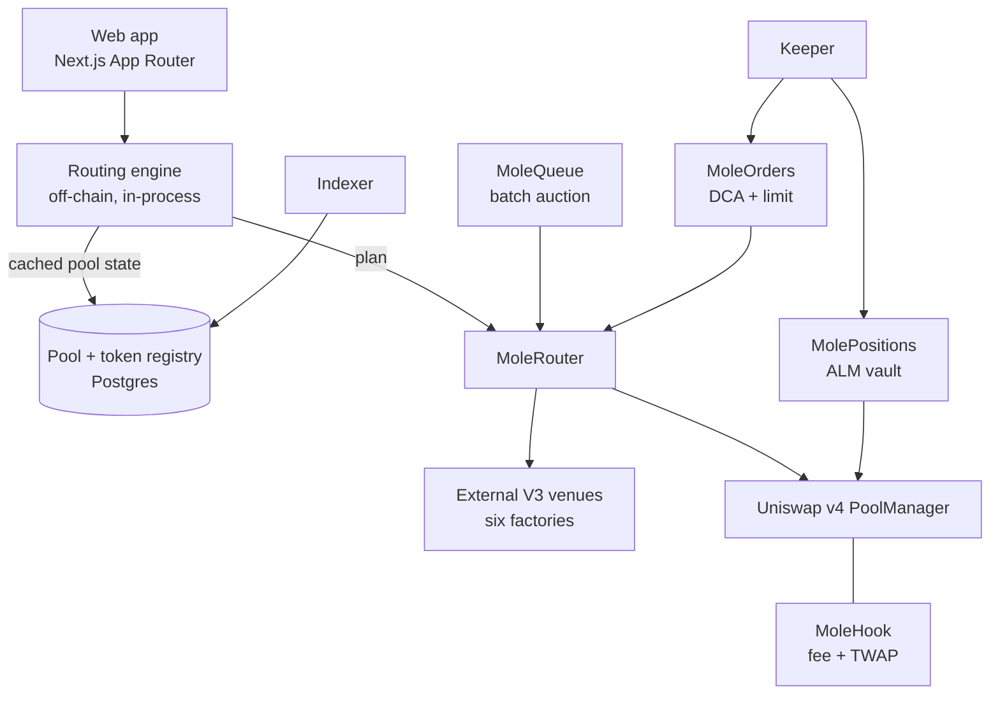

# MoleSwap

A DEX aggregator and concentrated-liquidity AMM on [Robinhood Chain](https://robinhoodchain.blockscout.com) (chain ID `4663`).

MoleSwap does two things. It routes a swap across every venue on the chain and executes it in one
transaction, and it runs its own Uniswap v4 pools behind a hook that enforces fees and publishes a
TWAP oracle. Around those sit an actively-managed liquidity vault, a batch-auction queue, and an
allowance-based order book for DCA and limit orders.

Everything below is deployed and live on mainnet.

---

## Deployed contracts

| Contract | Address | Role |
| --- | --- | --- |
| `MoleRouter` | [`0x7D74a0959A321e362aDb171E405Ee97ADA6ca79d`](https://robinhoodchain.blockscout.com/address/0x7D74a0959A321e362aDb171E405Ee97ADA6ca79d) | Executes a routed plan in one call. Immutable, holds nothing between transactions. |
| `MoleHook` | [`0xb2c9A0af48dF8858F3765385E733Cd8776a138C4`](https://robinhoodchain.blockscout.com/address/0xb2c9A0af48dF8858F3765385E733Cd8776a138C4) | v4 hook: enforces the LP fee via the dynamic-fee override, maintains the TWAP. |
| `MolePositions` | [`0x674625B6E6a2614ef6e247aF099BEA2e65e1536A`](https://robinhoodchain.blockscout.com/address/0x674625B6E6a2614ef6e247aF099BEA2e65e1536A) | ALM vault. Custody of LP positions, keeper-driven rebalancing. |
| `MoleQueue` | [`0x3dCb2494cBC9604f270177E38160ae4CA76CDEbd`](https://robinhoodchain.blockscout.com/address/0x3dCb2494cBC9604f270177E38160ae4CA76CDEbd) | Batch auction. Crosses matched flow at the TWAP, routes only the residual. |
| `MoleOrders` | [`0x3279E08fE241669cD098F30156b9F1B8FCB0c67C`](https://robinhoodchain.blockscout.com/address/0x3279E08fE241669cD098F30156b9F1B8FCB0c67C) | DCA and limit orders. Non-upgradeable by design — see below. |
| `MoleFeeDial` | [`0xd36C845bfFDFb4b204A7aa0b0CB3D205A6e1A9e8`](https://robinhoodchain.blockscout.com/address/0xd36C845bfFDFb4b204A7aa0b0CB3D205A6e1A9e8) | Aggregator fee, currently 69 bps against a hard ceiling of 100 bps. |
| `MoleFeeCollector` | [`0x4771865614D194Aa8b7aAB9d91e857686c37E584`](https://robinhoodchain.blockscout.com/address/0x4771865614D194Aa8b7aAB9d91e857686c37E584) | Destination for vault performance fees. |

Built against the canonical Uniswap v4 `PoolManager` at
[`0x8366a39CC670B4001A1121B8F6A443A643e40951`](https://robinhoodchain.blockscout.com/address/0x8366a39CC670B4001A1121B8F6A443A643e40951).

> **There is no canonical USDC on Robinhood Chain.** The stable leg is USDG at **six** decimals.
> Both "USDC" entries on the explorer are 18-decimal impostors. Nothing in this repository resolves a
> token by symbol; addresses and decimals are pinned, and a test fails the build if executable code
> under `frontend/lib/mole` so much as mentions USDC.

---

## Architecture



### Routing

Quotes are computed, not requested. The engine holds pool state in memory and prices a route with
arithmetic rather than a round trip to a `Quoter` contract — a split across dozens of pools is
evaluated in well under a millisecond, which is what makes quoting on every keystroke viable.

Two properties are worth calling out because they are easy to get wrong:

- **Splits are pool-disjoint.** A path is admitted into a split only if it shares no pool with an
  already-admitted, higher-ranked path. Pricing each path against pristine liquidity is exact only
  under that constraint; without it a split double-counts shared depth and promises an output the
  chain cannot deliver.
- **The tick bitmap is walked one word at a time**, exactly as the on-chain implementation does.
  Leaping an uninitialised gap in a single step reaches the same price but rounds differently, and at
  `minAmountOut` the difference is a reverted transaction rather than a rounding artefact.

Candidate pools come from the registry *and* from a live probe of every known factory and fee tier
for the requested pair, so a pool the indexer has not yet seen is still routable.

### The v4 pools

`MoleHook` is bound into the pool key, so it cannot be swapped out for a given pool. It re-asserts
the LP fee on every swap through the dynamic-fee override and maintains the TWAP the vault and the
batch queue price against.

`MolePositions` is the vault: it holds LP positions in custody and lets a keeper recentre them within
bounds it enforces itself — minimum and maximum range width, a recentre ceiling, a dwell time, a
per-block rebalance cap, and a maximum TWAP deviation. The keeper can act only inside those bounds.

`MoleQueue` batches flow and crosses whatever nets out at the TWAP, touching no pool. Only the
residual is routed. Two things follow: the crossed portion is separated from the part that can fail,
so a batch is never refunded wholesale because its leftover could not execute; and the fallback for
an unexecutable residual is deadline-gated, because a graceful degradation reachable on demand is a
denial-of-service primitive.

### Orders

`MoleOrders` never takes custody. Creating an order writes a record; each leg pulls exactly its own
input at fill time and the router delivers the output straight to the owner. The contract enforces
that the plan matches the order, that the recipient *is* the owner, that the price clears a
pro-rated floor, and that fills respect the interval. A keeper can therefore delay an order and
nothing else.

It is deliberately **not** upgradeable. Users grant it a standing allowance, and an immutable
contract cannot have a new path to that allowance added later.

### Off-chain services

- **Indexer** — discovers pools across the known factories, tracks token liquidity and metadata, and
  maintains the registry the routing engine reads. Writes go through secret-gated stored procedures
  rather than direct table access.
- **Keeper** — polls for fillable orders and submits them. It holds a signing key and no privileges
  beyond what the contracts grant it.

---

## Repository layout

```
src/          Solidity: router, hook, vault, queue, orders, fee dial, collector
script/       Foundry deployment and pool-creation scripts
test/         Foundry tests, including invariant and accounting suites
router/       Routing engine: pool math, path search, split solver
frontend/     Next.js app, API routes, and the client-side routing engine
services/     Indexer and keeper
backtest/     Historical simulation of the ALM strategy
lib/          Vendored dependencies (see note below)
```

**On the vendored `lib/`.** Dependencies are committed rather than submoduled. Deployed bytecode is a
function of exact dependency versions *and* optimizer settings, and one of this project's load-bearing
claims is that its `PoolManager` is byte-for-byte an audited deployment. Floating the dependencies
would mean the tree stops reproducing what is on mainnet, which is the property a published protocol
repository exists to provide. `lib/v4-core` is BUSL-1.1 and its licences are vendored intact; the
root `LICENSE` scopes itself explicitly and does not purport to relicense them.

---

## License

MIT for first-party code; see [`LICENSE`](./LICENSE) for the directories it covers and the vendored
dependencies it does not.
